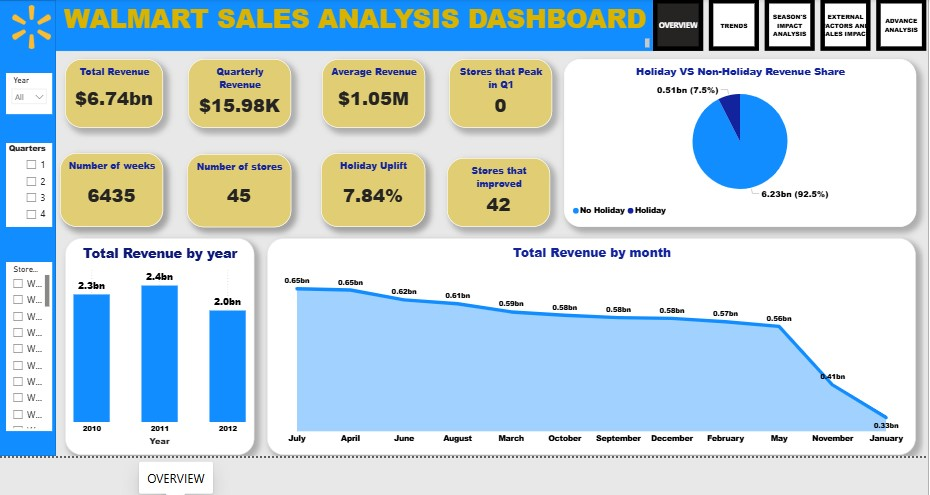
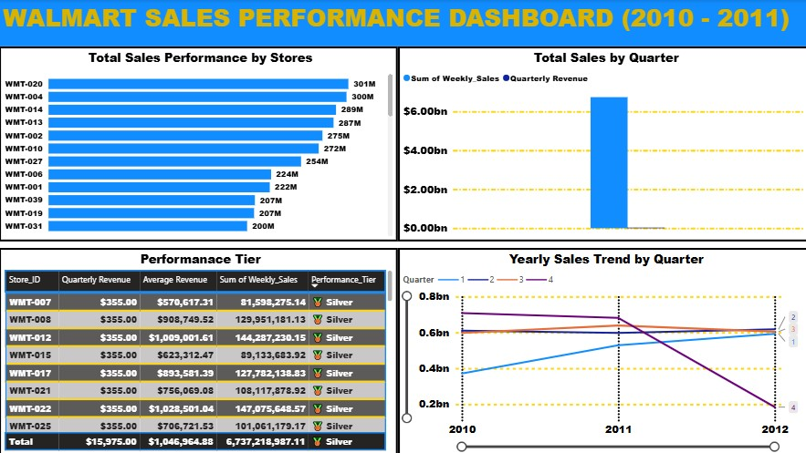
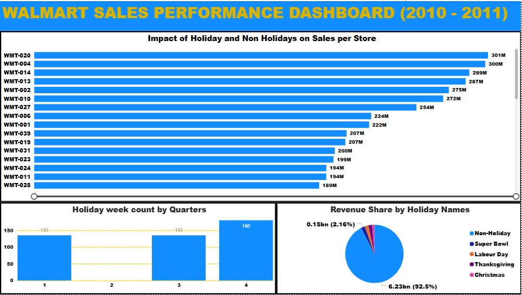
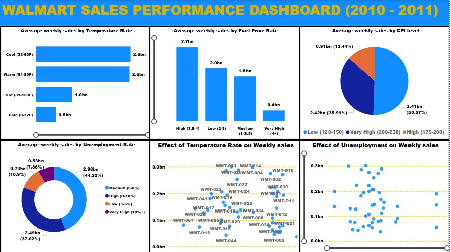
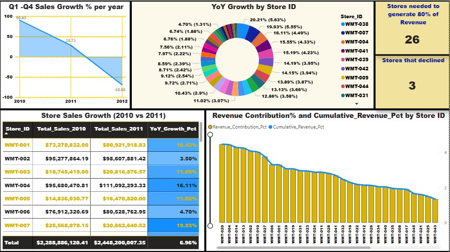

# WALMART SALES PERFORMANCE ANALYSIS
---

## INTRODUCTION

This project analyses Walmart's weekly sales performance data to uncover business insights across store rankings, seasonal trends, holiday impacts, external economic factors, and revenue distribution. The analysis follows a full data analytics pipeline from raw data ingestion through to executive reporting.
| Metric | Value |
|---|---|
|  Total Revenue | $6.74 Billion |
|  Total Stores | 45 |
|  Weeks Tracked | 143 |
|  Total Records | 6,435 rows |
|  Period | February 2010 – October 2012 |
|  Avg Weekly Sales | $1,046,965 per store |
|  Highest Single Week | $3,818,686 (Store 14, Christmas Eve 2010) |
| Lowest Single Week | $209,986 (Store 33, Dec 2010) |

---
## DESCRIPTION

**Source:** [Kaggle — Walmart Dataset by Yasser H](https://www.kaggle.com/datasets/yasserh/walmart-dataset)
| Column | Type | Description |
|---|---|---|
| `Row_ID` | Integer | Unique row identifier |
| `Store_ID` | String | Store identifier (WMT-001 to WMT-045) |
| `Store` | Integer | Store number (1–45) |
| `Date` | Date | Week ending date |
| `Weekly_Sales` | Decimal | Total store sales for the week ($) |
| `Holiday_Flag` | Binary | 1 = Holiday week, 0 = Non-holiday week |
| `Holiday_Label` | String | 'Holiday' or 'No Holiday' |
| `Holiday_Name` | String | Non-Holiday / Super Bowl / Labour Day / Thanksgiving / Christmas |
| `Temperature` | Decimal | Average regional temperature (°F) |
| `Fuel_Price` | Decimal | Regional fuel price ($ per gallon) |
| `CPI` | Decimal | Consumer Price Index |
| `Unemployment` | Decimal | Regional unemployment rate (%) |
| `Year` | Integer | Year (2010, 2011, 2012) |
| `Month` | Integer | Month number (1–12) |
| `Month_Name` | String | Full month name |
| `Quarter` | Integer | Quarter (1–4) |

---

## METHODOLOGY
| **Microsoft Excel** | Data cleaning, formatting, derived columns, pivot exploration |
| **SQL Server (SSMS)** | Structured analytical querying — aggregations, window functions, Pareto analysis |
| **Microsoft Power BI** | 9-page interactive dashboard with DAX measures and conditional formatting |
| **Microsoft PowerPoint** | 9-slide executive presentation with Walmart branding |

---

## ANALYSIS AND FINDINGS 
| 1 | **Overall Business Performance** | Total revenue, avg weekly sales, highest/lowest weeks |
| 2 | **Store Performance & Ranking** | Top/bottom 10 stores, YoY growth, most consistent stores |
| 3 | **Time & Seasonal Trends** | Monthly/quarterly/yearly breakdowns, YoY growth rate |
| 4 | **Holiday Impact Analysis** | Holiday vs non-holiday uplift, best holiday, per-store impact |
| 5 | **External Factors** | Temperature, fuel price, CPI and unemployment bucket analysis |
| 6 | **Advanced Analysis** | Q1 vs Q4 comparison, best quarter per year, quarterly growth 

- **Store 20** leads all-time total revenue at **$301.4M**
- **Store 14** recorded the highest single week at **$3,818,686** (Christmas Eve 2010)
- **8x revenue gap** between the top and bottom performing stores
- **12 Platinum stores** average over $1.4M per week; **11 Bronze stores** average under $556K
- **9 Elite stores** (1, 2, 4, 6, 10, 13, 14, 20, 27) maintained top-10 rankings every year
- **Q3 is the strongest quarter** overall ($1.84B), ahead of Q4 ($1.57B)
- **July is the best month** at $650M driven by back-to-school and summer events
- **January is the weakest month** at $332M — post-holiday spending crash
- **Zero stores ever peak in Q1** — universally the weakest quarter across all 45 stores
- **Q4 outperforms Q1** by 12.2% on a per-week average ($1,129K vs $1,006K)
- Holiday weeks deliver a **+7.84% sales uplift** vs non-holiday weeks
- **Thanksgiving beats Christmas in all 45 stores** — zero exceptions
- Thanksgiving average: **$1,471,273/week** vs Christmas: **$960,833/week**
- **92.5% of total revenue** comes from regular non-holiday weeks
- Q4 contains the most holiday weeks (180), Q2 contains zero
| Factor | Sales Impact Range | Verdict |
| **Unemployment** | **$338,720** |  Strongest impact |
| Temperature | $137,528 |  Moderate impact |
| CPI | $85,486 |  Moderate impact |
| Fuel Price | $23,450 |  Negligible impact |
- Low unemployment regions (3-6%) average **$1,181K/week** vs very high (10%+) at **$842K/week** — a **40% difference**
- Fuel price has minimal impact — customers trade down to Walmart as prices rise
- **26 stores (58%)** generate **80% of total revenue**
- Top 10 stores contribute **39.05%** of revenue ($2.63B)
- Bottom 10 stores contribute only **8.60%** ($580M)
- **Top 10 generate 4.5x more revenue** than the bottom 10

---

## Dashboard Screenshots

### Overview Dashboard

### Store Performance & Trends

### Holiday Impact Analysis

### External Factors & Sales Impact

### Advanced Analytics

---

##  KEY INSIGHTS

1.  **Thanksgiving, not Christmas, is Walmart's most valuable holiday** — Black Friday drives massive pre-Thanksgiving traffic
2.  **Summer is Walmart's peak revenue season** — July leads all months at $650M
3.  **Unemployment is the #1 external risk factor** — 40% swing between low and very high unemployment
4.  **Top 10 stores generate 4.5x more revenue than the bottom 10** — dramatic performance hierarchy
5.  **Peak performance ≠ overall strength** — Store 20 leads overall, Store 14 had the best single week
6.  **93% of stores grew YoY in 2011** — strong chain-wide momentum (+6.96%)
7.  **Christmas Eve 2010 was a once-in-dataset outlier** — 9 of 10 all-time peak weeks occurred on that date
8.  **Low-revenue stores are the most consistent** — but consistency reflects stagnation, not strength
9.  **Fuel price has negligible sales impact** — value retail cushions fuel price sensitivity
10.  **92.5% of revenue comes from non-holiday weeks** — everyday shopping drives the business

---

## RECOMMENDATIONS
| 1 | **Prioritise Thanksgiving** over Christmas in holiday planning — maximise Black Friday readiness | High |
| 2 | **Develop a Summer Sales Strategy** — dedicated Q3 promotions for July/August peak | High |
| 3 | **Monitor Unemployment** — implement regional pricing and inventory adjustments | High |
| 4 | **Review Bronze Tier Stores** — performance improvement programme for bottom 11 stores |  Medium |
| 5 | **Replicate Store 38's Turnaround** (+20.21% YoY) as a playbook for underperformers | Medium |
| 6 | **Protect Elite Stores** (1, 2, 4, 6, 10, 13, 14, 20, 27) — flagship investment priority | Ongoing |

---

## DATA SOURCE

> Yasser H. (2022). *Walmart Dataset*. Kaggle.
>  [https://www.kaggle.com/datasets/yasserh/walmart-dataset](https://www.kaggle.com/datasets/yasserh/walmart-dataset)

---

